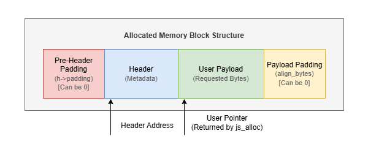
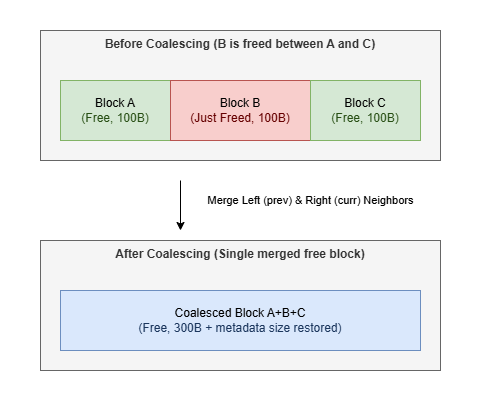

# Custom Memory Allocator (C++)

A lightweight, deterministic, first-fit memory allocator implemented in C++ for Windows. This allocator operates within a single pre-allocated arena using Windows `VirtualAlloc` and manages heap allocations manually using a singly-linked free list.

This is a learning project built to understand systems-level memory management, custom data layouts, alignment bounds, and fragmentation.

## 🛠️ Prerequisites & Compatibility
* **Operating System:** Windows (uses `<windows.h>` and `VirtualAlloc` / `VirtualFree`).
* **Compiler:** C++11 or newer (e.g. GCC/MinGW, MSVC).
* **Architecture:** Supported on both 32-bit and 64-bit platforms.

## 💾 Memory Layout

Each memory block consists of a **Header** (metadata) immediately followed by the **Payload** (usable memory). 

Here is the block-level structure showing both pre-header alignment padding and payload rounding padding:



## 🧠 Core Systems Concepts

### 1. Arena-Based Memory Management
Unlike the system allocator, this allocator acquires a single contiguous memory arena from the OS using `VirtualAlloc`.

All allocations are served from this arena until it becomes exhausted. No additional OS allocations are performed during normal allocator operation, making behavior deterministic and easy to reason about.


### 2. Free List Architecture
Free memory is tracked using a singly-linked free list.

Each free block stores its size and a pointer to the next available block. Allocation requests traverse this list to locate suitable space, while deallocation reinserts blocks back into the list in address order to enable coalescing.


### 3. First-Fit Allocation Strategy
The allocator uses a First-Fit search policy.

During allocation, the free list is traversed from the beginning and the first block large enough to satisfy the request is selected. This approach keeps allocation logic simple and fast while avoiding full-list scans.


### 4. Alignment & Padding
Modern CPUs expect many data types and structures to be stored at properly aligned addresses.

The allocator therefore calculates alignment requirements for both metadata and user payloads. Additional padding may be inserted before the header or after the payload to ensure alignment guarantees are preserved.


### 5. Why Pre-Header Padding Exists
When a free block begins at an arbitrary address, placing the header immediately at that location may violate the header's alignment requirements.

To prevent misaligned metadata access, the allocator inserts pre-header padding and shifts the header forward until it begins on a valid alignment boundary.


### 6. Block Splitting
If a free block is larger than the requested allocation, the allocator splits the block.

The requested portion is returned to the user while the remaining space is converted into a new free block and returned to the free list. This minimizes wasted memory and improves arena utilization.


### 7. Block Coalescing (Defragmentation)
To prevent the arena from degrading into many small unusable fragments, adjacent free blocks are merged whenever possible.

During deallocation, neighboring free blocks are checked for physical adjacency in memory. If contiguous, they are merged into a single larger block.




### 8. Reallocation Strategy
`js_realloc()` first attempts to resize a block in place.

If sufficient contiguous free space exists immediately after the allocation, the block grows without moving. Otherwise, a new allocation is created, data is copied, and the old block is released.


### 9. Runtime Instrumentation
The allocator maintains detailed runtime metrics to expose allocator behavior.

Statistics include allocation counts, deallocation counts, active requested bytes, active consumed bytes, and peak memory usage, providing visibility into fragmentation and allocator efficiency.

## ✨ Features

* **First-Fit Search:** Traverses the free list and chooses the first free block large enough to fit the requested allocation.
* **Eager Coalescing:** Automatically merges adjacent free blocks on both sides (forward and backward) during deallocation.
* **Double-Free Detection:** The allocator tracks block states and aborts deallocation attempts if a pointer is freed twice.
* **Detailed Metrics & Instrumentation:** Real-time statistics tracking:
  * Total active allocations and frees
  * Peak memory requested by the user
  * Active allocated bytes (payload only)
  * Active consumed bytes (payload + overhead + alignment padding)

## 🛠️ API Reference

### Function Reference

| Function Signature | Description | Category |
| :--- | :--- | :--- |
| `void* js_alloc(size_t bytes)` | Allocates `bytes` of aligned memory within the arena. Returns `nullptr` if the arena is exhausted. | Core Allocation |
| `void js_dealloc(void* ptr)` | Frees the memory block pointed to by `ptr` and coalesces adjacent free space. Safe against double frees. | Core Allocation |
| `void* js_realloc(void* ptr, size_t size)` | Resizes the memory block in place if contiguous space permits, or relocates and copies it. | Core Allocation |
| `void* js_calloc(size_t count, size_t size)` | Allocates zero-initialized memory for an array of `count` elements of `size` bytes each. | Core Allocation |
| `FreeBlock* js_get_freelist()` | Returns the head pointer of the singly-linked list of free blocks. | Diagnostics / Debug |
| `size_t js_get_capacity()` | Returns the total capacity of the allocator's memory arena (4 KB default). | Diagnostics / Debug |
| `const Stats& get_stats()` | Returns a reference to the global statistics (active count, peak usage, etc.). | Diagnostics / Debug |
| `void js_reset_allocator()` | Releases the entire virtual arena back to the Windows OS and resets all allocator metrics. | Lifecycle / Reset |

### Code Usage Example

```cpp
#include "allocator.h"
#include <iostream>

int main() {
    // 1. Basic Allocation & Deallocation
    int* ptr = (int*)js_alloc(sizeof(int) * 10);
    if (ptr) {
        ptr[0] = 42;
        std::cout << "Allocated array, first element: " << ptr[0] << std::endl;
        js_dealloc(ptr);
    }

    // 2. Zero-Initialized Allocation (calloc)
    double* zeros = (double*)js_calloc(5, sizeof(double));
    if (zeros) {
        std::cout << "Calloc elements initialized to: " << zeros[0] << std::endl; // Prints 0
    }

    // 3. Resizing Memory (realloc)
    // Grow the array from 5 to 10 doubles
    double* expanded = (double*)js_realloc(zeros, 10 * sizeof(double));
    if (expanded) {
        std::cout << "Successfully reallocated memory" << std::endl;
        js_dealloc(expanded);
    }

    // 4. Querying allocator statistics
    const Stats& metrics = get_stats();
    std::cout << "Peak memory used: " << metrics.peak_allocated_bytes << " bytes\n";

    // 5. Resetting Lifecycle
    js_reset_allocator(); // Releases arena memory back to Windows OS
    return 0;
}
```

### Instrumentation Statistics

Allocator statistics can be queried using `get_stats()`, which returns a reference to the following structure defined in [allocator.h](allocator.h):

```cpp
struct Stats {
    size_t current_allocated_bytes;  // Bytes currently allocated to user payload
    size_t current_consumed_bytes;   // Total bytes consumed (payload + header + padding)
    size_t peak_allocated_bytes;     // Peak memory requested by the user since init
    size_t total_allocations;        // Cumulative successful allocations
    size_t total_frees;              // Cumulative deallocations
    size_t failed_allocations;       // Cumulative allocation failures
};
```

## ⚠️ Known Limitations & Design Decisions

* **Single Threaded:** This allocator is optimized for single-threaded usage. It is **not thread-safe** (no mutex locks).
* **Single Arena:** The allocator initializes a fixed 4 KB arena. Once exhausted, allocations will fail.
* **Double-Free Post-Reuse Gap:** The double-free detector uses a flag in the header. If a pointer is freed, and the block is subsequently reallocated to another variable, a stale call to free the original pointer will not be caught.

## 🚀 Running the Tests

To compile and run the built-in test suite:

```bash
# Compile using G++
g++ -o main.exe allocator.cpp tests.cpp

# Execute the test binary
.\main.exe
```
